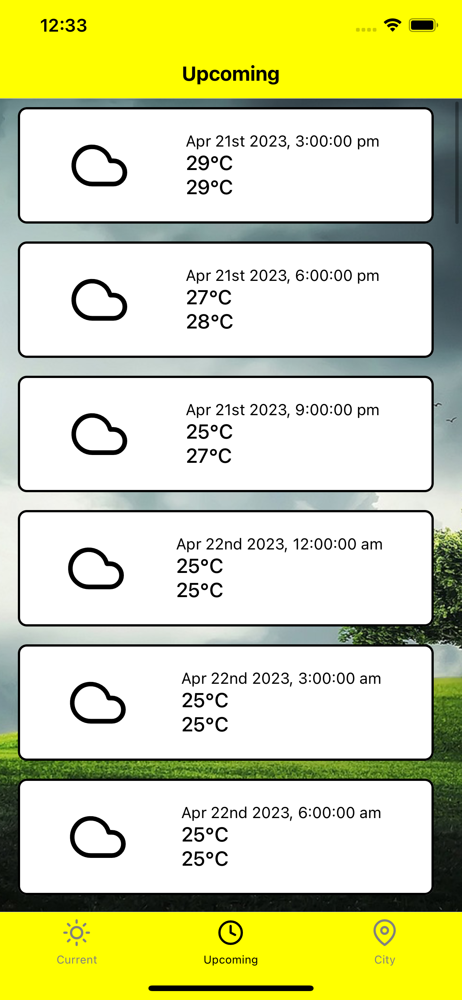
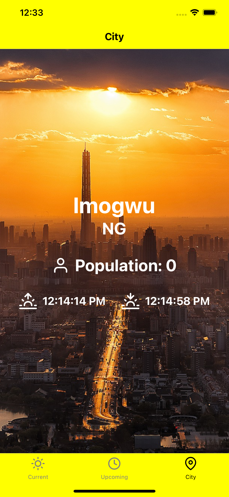

 React Native Weather App using OpenWeatherMap API

React Native Weather App using OpenWeatherMap API
=================================================

This is a basic React Native weather app built using Expo and OpenWeatherMap API.

Getting Started
---------------

1.  Clone the repository:

    git clone https://github.com/<username>/<repository>.git

2.  Install dependencies:

    cd <repository>
    npm install

3.  Set up OpenWeatherMap API key:

*   Create a free account at [OpenWeatherMap](https://openweathermap.org/) and obtain an API key.
*   Create a file named `.env` in the project root directory and add your API key like this:

    TEST_KEY=<your_api_key>

4.  Run the app:

    npm start

5.  Use the Expo app on your phone to scan the QR code displayed in the terminal or in the browser to open the app.

Features
--------

*  View current city name, country and population
*   View current weather conditions, including temperature, sunrise and sunset times, weather description
*   View a 5-day forecast of weather conditions, including temperature, min and max temperature.

Technologies
------------

*   React Native
*   Expo
*   OpenWeatherMap API

Screenshots
-----------

<!--   -->
 

<!--   -->

Contributing
------------

Contributions are always welcome! Please feel free to open an issue or submit a pull request.

License
-------

This project is licensed under the [MIT License](https://opensource.org/licenses/MIT).